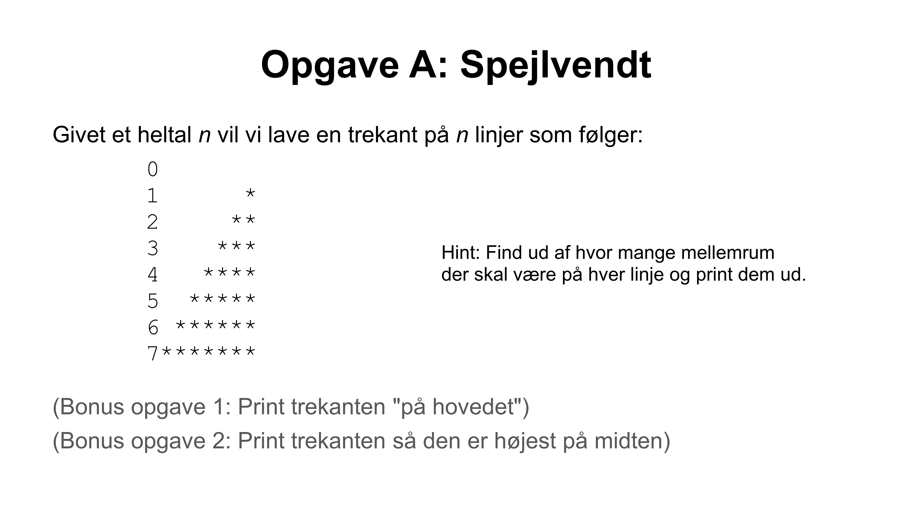
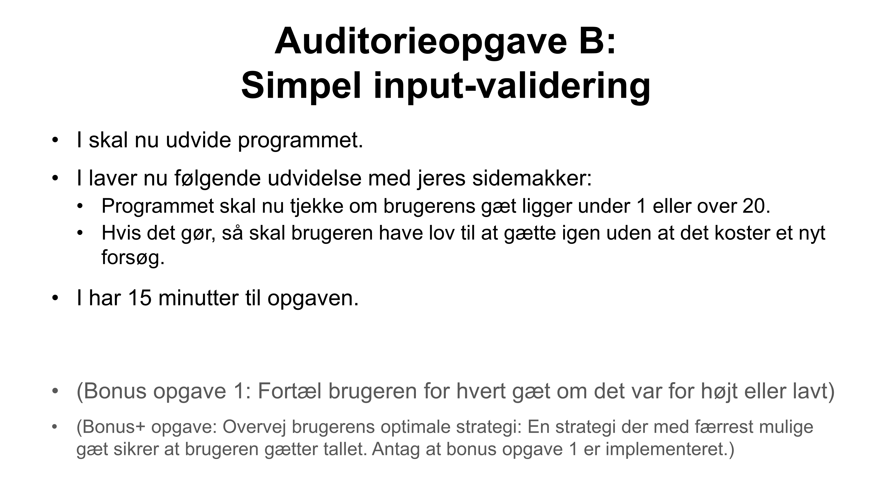

# Live coding for Lecture 4

Under live-coding arbejder jeg (underviseren) i filen [src/live.c](src/live.c).
Du kan evt. selv taste med her, eller du kan bare følge med på min skærm.

[ASCII Firkant](src/firkant.c)

[ASCII Trekant](src/trekant.c)

## Auditorieopgave A

[ASCII Omvendt Trekant](src/omvendt.c)

---

## Auditorieopgave B

[Gæt et tal](src/guess.c)

